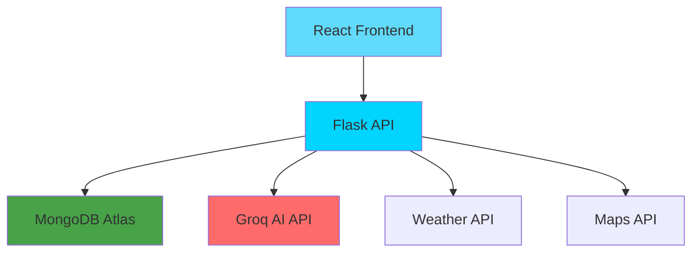
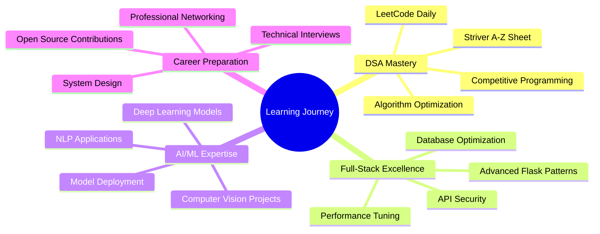

<div align="center">

<!-- Header with gradient background effect -->


</div>

<!-- Animated typing introduction -->
<div align="center">
  
</div>

<!-- Professional badges -->
<div align="center">
  
  
  
  
</div>

<!-- Social connections with hover effects -->
<div align="center">
  <br>
  <a href="https://www.linkedin.com/in/varunreddy-mandadi-996b14259" target="_blank">
    
  </a>
  <a href="https://github.com/varun339658" target="_blank">
    
  </a>
  <a href="mailto:mandadivarunreddy339658@gmail.com" target="_blank">
    
  </a>
  <a href="tel:6301842932" target="_blank">
    
  </a>
</div>

<br>

<!-- Stylish divider -->


<!-- About Me Section with modern cards -->
<h2 align="center">
  
  About Me
</h2>

<div align="center">
<table width="100%">
<tr>
<td width="60%" valign="top">

### 🎯 **Professional Summary**
```yaml
Name: Varun Reddy Mandadi
Role: Full-Stack Developer & AI Enthusiast
Education: B.Tech IT @ MVSR Engineering College
Location: Hyderabad, Telangana, India
Experience: AI Intern @ Robic Rufarm India
Interests: [AI/ML, Full-Stack Development, DSA]
```

### 🚀 **What I'm Building**
- 🤖 **AI-Powered Web Apps** using Flask, MongoDB & Modern APIs
- 🧠 **Computer Vision Solutions** for real-world industry problems  
- 📊 **Data-Driven Dashboards** with interactive visualizations
- 🌐 **Scalable REST APIs** with authentication & cloud deployment

### 🎯 **Current Mission**
- 📚 **Mastering DSA** through Striver A-Z Sheet & LeetCode
- 🏗️ **Building Production-Ready** AI applications
- 🔍 **Preparing for FAANG** technical interviews
- 🌟 **Contributing to Open Source** projects

</td>
<td width="40%" align="center">
  
  
  <br><br>
  
  
</td>
</tr>
</table>
</div>


<!-- Tech Stack with modern design -->
<h2 align="center">
  
  Tech Arsenal
</h2>

<div align="center">

### 💻 **Languages & Frameworks**
<p>
  
</p>

### 🗄️ **Databases & Tools**  
<p>
  
</p>

### 🤖 **AI/ML & Cloud**
<p>
  
</p>

<!-- Skill progress bars -->
<table width="100%">
<tr>
<td width="50%">

**Backend Development**


**AI/ML**


</td>
<td width="50%">

**Frontend Development**


**Database & DevOps**


</td>
</tr>
</table>

</div>


<!-- Featured Projects with modern cards -->
<h2 align="center">
  
  Featured Projects
</h2>

<!-- Project 1: India Travel Explorer -->
<div align="center">

### 🌍 **India Travel Explorer**
*AI-Powered Travel Companion*


</div>

<table>
<tr>
<td width="50%">

#### 🚀 **Key Features**
- 🤖 **Intelligent Chatbot** powered by Groq API
- 🗺️ **Interactive Maps** with Leaflet.js integration
- 🌦️ **Real-time Weather** & location services
- 📸 **Monument Recognition** using Roboflow AI
- 🎨 **Responsive UI** with modern design

#### 🛠️ **Tech Implementation**
```python
# AI Integration
groq_client = Groq(api_key=GROQ_API_KEY)
response = groq_client.chat.completions.create(
    model="mixtral-8x7b-32768",
    messages=travel_context
)
```

</td>
<td width="50%">

#### 📊 **Architecture Overview**


#### 🎯 **Impact & Results**
- ⚡ **Response Time:** < 2 seconds for AI queries
- 📱 **Mobile Responsive:** 100% compatibility
- 🌍 **Coverage:** All major Indian destinations
- 👥 **User Experience:** Intuitive & engaging

</td>
</tr>
</table>

---

<!-- Project 2: AI Tutor -->
<div align="center">

### 📚 **AI Tutor for MPC Students** 
*Hackathon Winner - AIthon 2024*


</div>

<table>
<tr>
<td width="50%">

#### 🧠 **AI Features**
- 💬 **Contextual Q&A** for Math, Physics, Chemistry
- 📊 **Learning Analytics** with progress tracking
- 🔍 **OCR Integration** for document processing
- 📝 **Adaptive Quizzes** based on performance
- 📈 **Visual Progress** dashboards

#### 💡 **Innovation Highlights**
- **Multi-subject expertise** in one platform
- **Personalized learning paths** using AI
- **Real-time doubt resolution** system
- **Gamified learning experience**

</td>
<td width="50%">

#### 🏗️ **System Architecture**
```yaml
Frontend: HTML5, CSS3, JavaScript ES6
Backend: Flask with RESTful API design
Database: MongoDB with optimized schemas
AI Engine: Groq API for NLP processing
Authentication: JWT-based secure login
Deployment: Cloud-ready containerized setup
```

#### 📈 **Hackathon Metrics**
- 🎯 **Problem Solved:** Student learning efficiency
- ⏱️ **Development Time:** 24 hours
- 👨‍💻 **Team Size:** Solo project
- 🏅 **Final Rank:** 3rd out of 150+ teams

</td>
</tr>
</table>

---

<!-- Project 3: Aquaculture System -->
<div align="center">

### 🦐 **Aquaculture Health Monitoring System**
*Production-Ready Industry Solution*


</div>

<table>
<tr>
<td width="50%">

#### 🔬 **ML Capabilities**
- 🎯 **Disease Detection:** WSSV, Blackgill, etc.
- 📊 **Confidence Scoring:** ML model accuracy
- 📈 **Trend Analysis:** Historical health data
- 🚨 **Alert System:** Real-time notifications
- 📋 **Report Generation:** PDF, CSV, Excel

#### 🔐 **Enterprise Features**
- **OAuth 2.0 Authentication**
- **Role-based Access Control**
- **API Rate Limiting**
- **Data Encryption**
- **Audit Logging**

</td>
<td width="50%">

#### 🏭 **Production Impact**
```yaml
Farms Supported: 100+
Detection Accuracy: 94.7%
Response Time: <3 seconds
Uptime: 99.9%
Data Processed: 50GB+ monthly
Cost Reduction: 35% for farmers
```

#### 🚀 **Deployment Stack**
- **Backend:** Flask + Gunicorn + Nginx
- **Database:** MongoDB Atlas (Cloud)
- **ML Pipeline:** Roboflow + Custom Models
- **Monitoring:** Grafana + Prometheus
- **Infrastructure:** AWS EC2 + S3

</td>
</tr>
</table>


<!-- GitHub Analytics with modern styling -->
<h2 align="center">
  
  GitHub Analytics
</h2>

<div align="center">

<table>
<tr>
<td width="50%">
  
</td>
<td width="50%">
  
</td>
</tr>
</table>

<br>


<br><br>

<!-- GitHub Activity Graph -->


</div>


<!-- Professional Experience Section -->
<h2 align="center">
  
  Professional Journey
</h2>

<!-- Timeline of achievements -->
<div align="center">

### 🏆 **Achievements Timeline**

<table>
<tr>
<th width="15%">🗓️ Year</th>
<th width="25%">🎯 Achievement</th>
<th width="35%">📝 Description</th>
<th width="25%">🏅 Recognition</th>
</tr>
<tr>
<td align="center"><strong>2025</strong></td>
<td>🔧 <strong>Full-Stack Developer Intern</strong></td>
<td>Leading AI development at Robic Rufarm India</td>
<td></td>
</tr>
<tr>
<td align="center"><strong>2024</strong></td>
<td>🥉 <strong>AIthon 2024 Winner</strong></td>
<td>3rd place among 150+ teams in AI hackathon</td>
<td></td>
</tr>
<tr>
<td align="center"><strong>2024</strong></td>
<td>📜 <strong>Google AI/ML Internship</strong></td>
<td>Virtual program focusing on practical AI applications</td>
<td></td>
</tr>
<tr>
<td align="center"><strong>2022</strong></td>
<td>🎓 <strong>TS EAMCET Success</strong></td>
<td>Secured rank 7,000 in competitive entrance exam</td>
<td></td>
</tr>
</table>

</div>

### 💼 **Current Role Deep Dive**

<div align="center">
<table>
<tr>
<td width="30%" align="center">
  
  <br><br>
  <strong>🏢 Robic Rufarm India</strong>
  <br><em>Full-Stack Developer Intern</em>
  <br><code>May 2025 - Present</code>
  <br><small>📍 Hyderabad (Hybrid)</small>
</td>
<td width="70%">

#### 🚀 **Key Responsibilities**
- **AI Integration:** Implementing Roboflow APIs for automated disease detection in aquaculture
- **Full-Stack Development:** Building responsive web applications using Flask and MongoDB Atlas
- **API Development:** Creating RESTful APIs with authentication and data validation
- **Performance Optimization:** Achieving <3 second response times for ML predictions
- **Team Collaboration:** Working with cross-functional teams on production deployments

#### 📊 **Impact Metrics**
- 🎯 **Farms Served:** 100+ aquaculture operations
- ⚡ **System Uptime:** 99.9% availability
- 📈 **Cost Reduction:** 35% operational savings for clients
- 🔍 **Accuracy Rate:** 94.7% in disease detection

</td>
</tr>
</table>
</div>


<!-- Learning & Growth Section -->
<h2 align="center">
  
  Learning & Growth Roadmap
</h2>

<div align="center">

<!-- Current focus with progress tracking -->
<table width="100%">
<tr>
<td width="33%" align="center">
  
  <br><br>
  
  <br><br>
  <strong>🎯 Foundation Skills</strong>
  <br><br>
  ✅ Full-Stack Web Development<br>
  ✅ Flask & MongoDB Integration<br>
  ✅ RESTful API Design<br>
  ✅ AI/ML Fundamentals<br>
  ✅ Computer Vision with OpenCV<br>
  ✅ Version Control with Git<br>
</td>
<td width="33%" align="center">
  
  <br><br>
  
  <br><br>
  <strong>📚 Current Learning</strong>
  <br><br>
  🔄 Advanced DSA (Striver A-Z Sheet)<br>
  🔄 System Design Fundamentals<br>
  🔄 ML Model Deployment & MLOps<br>
  🔄 Cloud Computing (AWS/Azure)<br>
  🔄 Docker & Kubernetes<br>
  🔄 Advanced Prompt Engineering<br>
</td>
<td width="33%" align="center">
  
  <br><br>
  
  <br><br>
  <strong>🚀 Future Targets</strong>
  <br><br>
  🎯 Microservices Architecture<br>
  🎯 Advanced AI/ML Algorithms<br>
  🎯 Open Source Contributions<br>
  🎯 Technical Writing & Blogging<br>
  🎯 FAANG Interview Preparation<br>
  🎯 Leadership & Team Management<br>
</td>
</tr>
</table>

### 📈 **Current Focus Areas**



</div>


<!-- Connect Section with modern design -->
<h2 align="center">
  
  Let's Connect & Collaborate
</h2>

<div align="center">


<h3><em>"Innovation distinguishes between a leader and a follower."</em></h3>
<h4>— Steve Jobs</h4>


<br>


<br><br>

<!-- Enhanced contact cards -->
<table>
<tr>
<td align="center" width="25%">
  <a href="https://www.linkedin.com/in/varunreddy-mandadi-996b14259" target="_blank">
    
    <br><small>Connect for opportunities</small>
  </a>
</td>
<td align="center" width="25%">
  <a href="mailto:mandadivarunreddy339658@gmail.com" target="_blank">
    
    <br><small>Discuss projects & ideas</small>
  </a>
</td>
<td align="center" width="25%">
  <a href="https://github.com/varun339658" target="_blank">
    
    <br><small>Explore my repositories</small>
  </a>
</td>
<td align="center" width="25%">
  <a href="tel:6301842932" target="_blank">
    
    <br><small>Instant communication</small>
  </a>
</td>
</tr>
</table>

### 🎯 **What I'm Looking For**

<table width="100%">
<tr>
<td width="50%" align="center">
  
  <br><br>
  💼 **Full-Stack Developer Roles**<br>
  🤖 **AI/ML Engineering Positions**<br>
  🚀 **Startup Collaborations**<br>
  📚 **Mentorship Programs**
</td>
<td width="50%" align="center">
  
  <br><br>
  🌟 **Open Source Projects**<br>
  💡 **Innovative Tech Solutions**<br>
  📖 **Knowledge Sharing**<br>
  🎯 **Hackathon Partnerships**
</td>
</tr>
</table>

</div>


<!-- Footer with stats and animation -->
<div align="center">


<img
