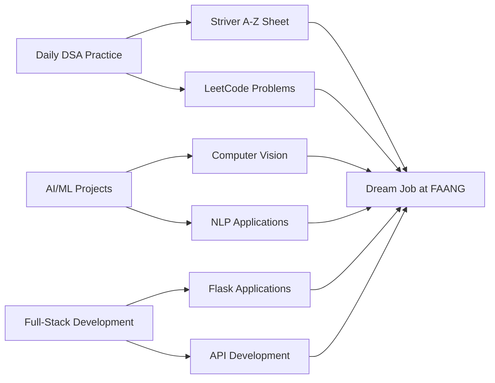

<h1 align="center">Hi there 👋, I'm Varun Reddy Mandadi</h1>
<h3 align="center">Full-Stack Developer • AI/ML Enthusiast • Open Source Explorer</h3>

---

  

---

## 👨‍💻 About Me

🎓 **Final-Year B.Tech IT Student** @ MVSR Engineering College, Hyderabad  
📊 **CGPA:** 8.0 | 🏆 **Hackathon Winner** | 💼 **AI Intern** @ Robic Rufarm  

### 🔥 What I Do:
- 🚀 Building **AI-powered web applications** with Flask & MongoDB
- 🧠 Mastering **Data Structures & Algorithms** via Striver A-Z Sheet
- 🤖 Developing **Computer Vision & NLP solutions** for real-world problems
- 🌐 Creating **full-stack applications** with modern tech stacks

### 🎯 Current Focus:
- **DSA Practice:** Daily problem-solving on LeetCode & Striver Sheet
- **AI/ML Projects:** Computer Vision, NLP chatbots, and ML model deployment  
- **Full-Stack Development:** Flask, MongoDB, REST APIs, and responsive UIs
- **Career Goal:** Landing a role at **Google, Amazon, Microsoft, or OpenAI**

> 💡 **Fun Fact:** Won 3rd place in AIthon 2024 competing against 150+ teams!

---

## 💻 Tech Stack

**Languages:**  

**Web Development:**  

**AI/ML & Tools:**  

---

## 🚀 Featured Projects

### 🌍 **India Travel Explorer** *(Jan 2025 - Mar 2025)*
**AI-based travel platform with interactive maps & intelligent recommendations**
- 🤖 **NLP Chatbot** using Groq API for personalized travel advice
- 🗺️ **Interactive Maps** with Leaflet.js + real-time location data
- 🌦️ **Weather Integration** (OpenWeather API) + **Monument Recognition** (Roboflow)
- 📍 **Multi-API Integration:** Geoapify, Unsplash, Google Maps 360° views
- 🔗 **Tech Stack:** Flask, MongoDB, JavaScript, REST APIs, Prompt Engineering

### 📚 **AI Tutor for MPC Students** *(AIthon 2024 - 🥉 3rd Place)*
**Smart learning platform for Math, Physics & Chemistry - Competed against 150+ teams**
- 🧠 **NLP-powered Chatbot** with Groq API for conceptual Q&A
- 📊 **Study Dashboard** with topic tracking & progress analytics
- 🔍 **OCR Integration** for document content extraction
- 📝 **Interactive Quizzes** with personalized learning paths
- 🔗 **Tech Stack:** HTML, CSS, JavaScript, Flask, MongoDB, Groq API

### 🦐 **Aquaculture Health Monitoring System** *(May 2025 - Present)*
**Real-time AI-powered disease detection for fish & shrimp farming**
- 🔬 **ML Image Classification** for disease detection (WSSV, Blackgill, etc.)
- 📊 **Dynamic Dashboards** with Chart.js visualizations
- 🔐 **OAuth 2.0 Authentication** & comprehensive user management
- 📄 **Multi-format Reports** (PDF, CSV, Excel) for farm analytics
- 🌐 **RESTful APIs** with Flask backend & MongoDB Atlas
- 🔗 **Current Role:** Full-Stack Developer Intern @ Robic Rufarm India

---

## 📊 GitHub Analytics

  
  

  

---

## 🏆 Achievements & Experience

| 🎯 **Achievements** | 📅 **Date** |
|---------------------|-------------|
| 🥉 **3rd Place** - AIthon 2024 (AI Hackathon) | *150+ teams* |
| 🎓 **CGPA: 8.0** - B.Tech IT @ MVSR | *Nov 2022 - Present* |
| 🎯 **Rank 7,000** - TS EAMCET 2022 | *Non-Local Category* |
| 📜 **Google AI/ML Virtual Internship** | *Apr - Jun 2024* |
| 🏅 **Full-Stack Web Development Certification** | *Udemy - Jan 2025* |

### 💼 **Professional Experience**

**🔧 Full-Stack Developer Intern** - *Robic Rufarm India Pvt. Ltd.*  
*May 2025 - Present | Hyderabad (Remote/Hybrid)*
- Building AI-powered health monitoring system for aquaculture industry
- Integrated Roboflow API for automated disease detection with confidence scoring
- Developed RESTful APIs and responsive frontend using Flask & MongoDB Atlas
- Supporting data-driven decision-making for 100+ aquaculture farms

---

## 🔭 Currently Working On

- 📌 **Mastering Striver A-Z DSA Sheet** (Data Structures & Algorithms)
- 🧠 **Building production-ready AI applications** with Flask & MongoDB
- 📂 **Contributing to open-source projects** on GitHub
- 🚀 **Preparing for technical interviews** at top product companies
- 🔗 **Deploying projects** using modern cloud platforms

---

## 🎯 Learning Journey

**✅ Completed:**
- Full-Stack Web Development (HTML, CSS, JS, Flask, MongoDB)
- AI/ML Fundamentals & Computer Vision with OpenCV
- RESTful API Development & Third-party API Integration
- Google AI/ML Virtual Internship Program

**🔄 Currently Learning:**
- Advanced Data Structures & Algorithms (Striver Sheet)
- Machine Learning Model Deployment
- System Design Fundamentals
- Cloud Computing & DevOps Basics

**🔜 Next Goals:**
- Contributing to major open-source projects
- Building scalable microservices architecture
- Advanced prompt engineering & LLM integration
- Preparing for FAANG interviews

---

## 📫 Let's Connect!

> *"Consistency beats talent. Code daily, learn continuously, build relentlessly."*  
> **- Varun Reddy Mandadi**

**💬 Always open to collaborations, internships, and exciting tech discussions!**

---

  
  
  **⭐ Thanks for visiting! Happy Coding! 🚀**

