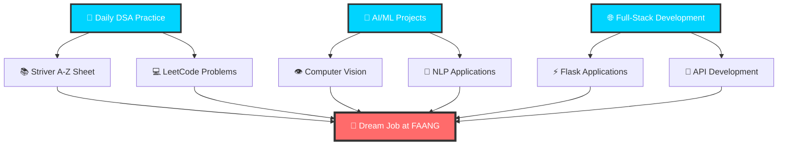

# Varun Reddy Mandadi

  

 

  

 

  

 

  

##  About Me

  <table border="0" cellpadding="10" cellspacing="0">
    <tr>
      <td align="left" width="60%">
        
🎓 **Final-Year B.Tech IT Student** @ MVSR Engineering College, Hyderabad  
📊 **CGPA:** 8.0 | 🏆 **Hackathon Winner** | 💼 **AI Intern** @ Robic Rufarm  

###  What I Do:
- 🚀 Building **AI-powered web applications** with Flask & MongoDB
- 🧠 Mastering **Data Structures & Algorithms** via Striver A-Z Sheet
- 🤖 Developing **Computer Vision & NLP solutions** for real-world problems
- 🌐 Creating **full-stack applications** with modern tech stacks

###  Current Focus:
- **DSA Practice:** Daily problem-solving on LeetCode & Striver Sheet
- **AI/ML Projects:** Computer Vision, NLP chatbots, and ML model deployment  
- **Full-Stack Development:** Flask, MongoDB, REST APIs, and responsive UIs
- **Career Goal:** Landing a role at **Google, Amazon, Microsoft, or OpenAI**
<tr>
      </td>
      <td align="center" width="40%">
        
      </td>
    </tr>
  </table>

  
  <b>🎯 Fun Fact:</b> Won 3rd place in AIthon 2024 competing against 150+ teams!
  

 

  

##  Tech Stack & Tools

### 💻 Programming Languages

  
  
  

### 🌐 Web Development

  
  
  
  

### 🤖 AI/ML & Development Tools

  
  
  
  

 

  

##  Featured Projects

### 🌍 **India Travel Explorer** 
*Jan 2025 - Mar 2025*

**AI-based travel platform with interactive maps & intelligent recommendations**

- 🤖 **NLP Chatbot** using Groq API for personalized travel advice
- 🗺️ **Interactive Maps** with Leaflet.js + real-time location data
- 🌦️ **Weather Integration** (OpenWeather API) + **Monument Recognition** (Roboflow)
- 📍 **Multi-API Integration:** Geoapify, Unsplash, Google Maps 360° views
- **Tech Stack:** `Flask` `MongoDB` `JavaScript` `REST APIs` `Prompt Engineering`

---

### 📚 **AI Tutor for MPC Students** 
*AIthon 2024 - 🥉 3rd Place*

**Smart learning platform for Math, Physics & Chemistry - Competed against 150+ teams**

- 🧠 **NLP-powered Chatbot** with Groq API for conceptual Q&A
- 📊 **Study Dashboard** with topic tracking & progress analytics
- 🔍 **OCR Integration** for document content extraction
- 📝 **Interactive Quizzes** with personalized learning paths
- **Tech Stack:** `HTML` `CSS` `JavaScript` `Flask` `MongoDB` `Groq API`

---

### 🦐 **Aquaculture Health Monitoring System** 
*Current Internship Project*

**Real-time AI-powered disease detection for fish & shrimp farming**

- 🔬 **ML Image Classification** for disease detection (WSSV, Blackgill, etc.)
- 📊 **Dynamic Dashboards** with Chart.js visualizations
- 🔐 **OAuth 2.0 Authentication** & comprehensive user management
- 📄 **Multi-format Reports** (PDF, CSV, Excel) for farm analytics
- 🌐 **RESTful APIs** with Flask backend & MongoDB Atlas
- **Building this during my Full-Stack Developer Internship @ Robic Rufarm India**

 

  

##  GitHub Analytics

  
  

 

  

 

  

 

  

##  Achievements & Experience

### 🏆 Achievements

| Achievement | Details | Status |
|:------------|:--------|:------:|
| 🥉 **AIthon 2024 - 3rd Place** | AI Hackathon (150+ teams) | ✅ |
| 🎓 **Academic Excellence** | CGPA: 8.0 @ MVSR Engineering | 📚 |
| 🎯 **TS EAMCET 2022** | Rank 7,000 (Non-Local) | 🏆 |
| 📜 **Google AI/ML Internship** | Virtual Program (Apr-Jun 2024) | 🧠 |
| 🏅 **Full-Stack Certification** | Udemy (Jan 2025) | 💻 |

### 💼 Professional Experience

  

**🔧 Full-Stack Developer Intern** - **Robic Rufarm India Pvt. Ltd.**  
*May 2025 - Present | Hyderabad (Remote/Hybrid)*

- 🚀 Building AI-powered health monitoring system for aquaculture industry
- 🔗 Integrated Roboflow API for automated disease detection with confidence scoring
- ⚡ Developed RESTful APIs and responsive frontend using Flask & MongoDB Atlas
- 📈 Supporting data-driven decision-making for 100+ aquaculture farms

 

  

##  Currently Working On

```mermaid
graph TD
    A[🧮 Daily DSA Practice] --> B[📚 Striver A-Z Sheet]
    A --> C[💻 LeetCode Problems]
    
    D[🤖 AI/ML Projects] --> E[👁️ Computer Vision]
    D --> F[💬 NLP Applications]
    
    G[🌐 Full-Stack Development] --> H[⚡ Flask Applications]
    G --> I[🔗 API Development]
    
    B --> J[🎯 Dream Job at FAANG]
    C --> J
    E --> J
    F --> J
    H --> J
    I --> J
    
    style A fill:#00d4ff,stroke:#333,stroke-width:3px,color:#fff
    style D fill:#00d4ff,stroke:#333,stroke-width:3px,color:#fff
    style G fill:#00d4ff,stroke:#333,stroke-width:3px,color:#fff
    style J fill:#ff6b6b,stroke:#333,stroke-width:4px,color:#fff
```

### 🎯 Current Priorities:
- 📌 **Mastering Striver A-Z DSA Sheet** (Data Structures & Algorithms)
- 🧠 **Building production-ready AI applications** with Flask & MongoDB
- 📂 **Contributing to open-source projects** on GitHub
- 🚀 **Preparing for technical interviews** at top product companies
- 🔗 **Deploying projects** using modern cloud platforms

 

  

##  Learning Journey

  <table>
    <tr>
      <td align="center" width="33%">
        
          
        ✅ Full-Stack Web Development 
        ✅ AI/ML Fundamentals & OpenCV 
        ✅ RESTful API Development 
        ✅ Google AI/ML Virtual Internship
      </td>
      <td align="center" width="33%">
        
          
        🔄 Advanced DSA (Striver Sheet) 
        🔄 ML Model Deployment 
        🔄 System Design Fundamentals 
        🔄 Cloud Computing & DevOps
      </td>
      <td align="center" width="33%">
        
          
        🎯 Open-source Contributions 
        🎯 Microservices Architecture 
        🎯 Advanced Prompt Engineering 
        🎯 FAANG Interview Preparation
      </td>
    </tr>
  </table>

 

  

##  Let's Connect!

  
  
  <h3><i>"Consistency beats talent. Code daily, learn continuously, build relentlessly."</i></h3>
  
  
   
  
  

  

 

  

  
  
    
  
  
  <h2><b>⭐ Thanks for visiting! Happy Coding! 🚀</b></h2>
  
  

 

  

